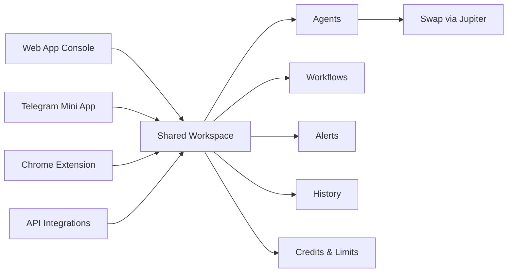

<h1 align="center">Cortanix AI</h1>

> [!IMPORTANT]
> **Cortanix AI** is an AI-powered on-chain trading workspace built to turn token, wallet, and news data into structured, actionable insight across a Web App, Telegram Mini App, Chrome Extension, and future API integrations

Cortanix exists for traders who do not want to jump between explorers, charts, feeds, and swap tools just to understand what is happening around a token or wallet. It brings analytics, AI agents, workflow logic, and execution context into one connected system

> [!TIP]
> The same account, shared credit balance, saved history, and agent logic follow you across every Cortanix surface, so you can move between terminal, chat, and extension without losing context

    

---

## Intro

Cortanix AI is an AI-powered trading platform focused on on-chain markets. It helps users analyze tokens and wallets, understand risk and behavior, track narratives, and move from insight to execution faster without relying on raw dashboards alone

It exists to simplify a fragmented process: research the asset, understand the wallet behavior, check the surrounding news, and then act only when the setup makes sense

> [!WARNING]
> Cortanix can surface swap-ready opportunities through Jupiter context, but it does not custody funds and does not execute trades for the user automatically

---

## Journey Map

Cortanix is one workspace with multiple surfaces around it. No matter where the request starts, the result flows into the same shared account logic, saved runs, and credit system

---

## Step-by-Step Flow

### 1. Connect your wallet

Sign in with a supported wallet and create a wallet-based identity for plans, credits, settings, and history

### 2. Choose what to inspect

Open a token, wallet, or project context and decide whether to run token analytics, wallet analytics, or the AI news research agent

### 3. Let the agents do the heavy lifting

Cortanix pulls structured on-chain, market, and news data, passes it through the Orchestrator, and returns a clear AI-generated result with scores, labels, flags, and summary

### 4. Act on the output

Review the insight, revisit saved runs, track what matters, and optionally trigger a swap through Jupiter when you want execution context right next to the analysis

> [!NOTE]
> Past results stay available in history, so rereading an existing report does not require paying credits again

---

## What You Unlock

| Layer | What you get |
|---|---|
| Token Analytics | Liquidity, volume, holder distribution, flow signals, market health indicators, AI summary |
| Wallet Analytics | PnL view, trading behavior, risk style, notable flows, AI narrative |
| News Research Agent | Condensed project updates, signal filtering, relevance summary, watchlist context |
| Workflows | Multi-step sequences with triggers, agents, outputs, retries, and delivery logic |
| Shared History | Saved results across Web App, Telegram Mini App, and Extension |
| Credits System | One balance for all surfaces, transparent usage by action, refill via plans |

> [!CAUTION]
> Credit-based actions are available only while your balance is positive. When credits reach zero, new analyses are blocked, but your past reports and general access remain available

---

## Visual Layer

Cortanix is designed as a connected product surface rather than a single app

- **Web App** for full terminal-style analysis and deeper workflow control
- **Telegram Mini App** for chat-first AI interaction and portable access
- **Chrome Extension** for quick context and lightweight actions directly from the browser
- **Future API layer** for calling agents and workflows from external systems

> [!IMPORTANT]
> The Telegram Mini App is one of the core Cortanix surfaces and is designed for a native, lightweight workflow inside Telegram

---

## Entry Point

Getting started is intentionally simple

1. Connect a wallet
2. Receive the free one-time starter credits
3. Run your first token, wallet, or news analysis
4. Review the structured result
5. Upgrade or top up with **$CORTANIX** when you want more capacity

> [!TIP]
> The free tier is enough to test real workflows and understand how Cortanix agents behave before moving into regular usage

---

## System Base

| Component | Role |
|---|---|
| API & Gateway | Authentication, request validation, routing, rate limits |
| Orchestrator | Job creation, queues, retries, timeouts, agent/tool coordination |
| Models Layer | Token analyst, wallet analyst, news research agent |
| Data Layer | On-chain and market data abstraction with caching and fallbacks |
| Storage | Results, history, billing records, credits, projects |
| Jupiter Integration | Non-custodial swap routing from analysis context |

Cortanix follows a clean separation of roles: clients handle the experience, the backend handles logic and reliability, agents handle interpretation, and Jupiter handles execution routing

---

## Disclaimer

Cortanix is an analytics and AI workflow platform for on-chain markets. It is not financial advice, does not guarantee outcomes, and does not take custody of user funds. All swaps are confirmed and signed by the user through their own wallet
